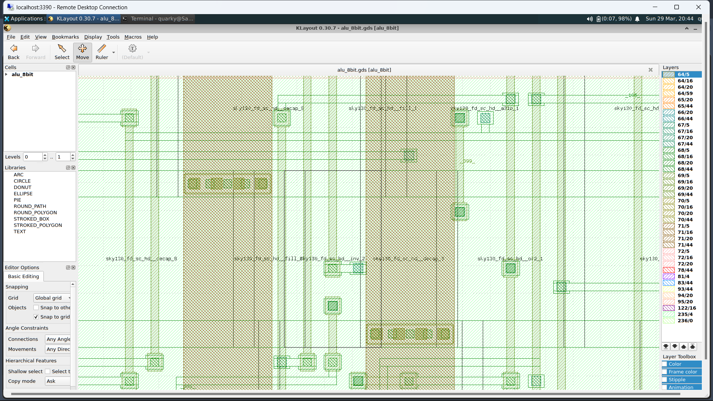

# RTL-to-GDS Implementation of 8-bit ALU

**Technology:** Sky130 PDK &nbsp;|&nbsp; **Tool:** OpenLane &nbsp;|&nbsp; **Design:** 8-bit Arithmetic Logic Unit

---

## Overview

This project documents the complete RTL-to-GDSII physical design flow of an 8-bit ALU
using the OpenLane open-source toolchain and the Sky130 Process Design Kit.

It covers the entire backend VLSI pipeline from writing the RTL in Verilog to generating
a DRC and LVS clean GDSII layout, including synthesis, floorplanning, placement,
clock tree synthesis, routing, and signoff verification.

The motivation behind this project was bridging the awareness gap that exists among
early-year students around VLSI design. A significant part of real chip design work
happens entirely using EDA tools on Linux, with no expensive hardware or paid licenses
required. This project was an attempt to demonstrate that and document the journey.

---

## What This Involved

**RTL Design and Simulation**
- Designed the 8-bit ALU in Verilog HDL supporting arithmetic and logic operations
- Written and verified against a dedicated testbench using Icarus Verilog
- Waveform verified in GTKWave before entering the physical design flow

**Physical Design Flow**
- Synthesis using Yosys, mapping RTL to Sky130 HD standard cell library
- Floorplanning to define core area and die dimensions
- Global and detailed placement of standard cells
- Clock tree synthesis for balanced clock distribution
- Global and detailed routing
- Signoff: DRC, LVS, static timing analysis, IR drop analysis, and antenna checks
- Multi-corner analysis across Fastest, Typical, and Slowest process corners

---

## Results

| Metric | Result |
|--------|--------|
| Standard Cells | 115 cells across 36 unique cell types |
| Chip Area | 998 square micrometers |
| Setup Slack | +3.41 ns |
| Hold Slack | +4.34 ns |
| Total Negative Slack | 0 |
| Total Power | 60.8 microwatts (typical corner) |
| DRC Violations | 0 |
| LVS Errors | 0 |
| Antenna Violations | 0 |
| Verified Nets | 164 |

---

## Simulation Waveform

RTL verified using Icarus Verilog with waveform viewed in GTKWave.

---

## Layout Visualization

### Full Layout

### Zoomed View

### Routing View

---

## Tools Used

| Tool | Role |
|------|------|
| OpenLane | End-to-end RTL-to-GDS flow |
| OpenROAD | Physical design engine |
| Yosys | RTL synthesis |
| Magic VLSI | DRC and extraction (via OpenLane) |
| KLayout | Layout visualization |
| Icarus Verilog | RTL simulation |
| GTKWave | Waveform viewing |
| Sky130 PDK | Process Design Kit |

---

## What I Learned

- How digital designs move from RTL to a manufacturable GDSII layout
- How timing, power, and design constraints evolve across each stage of the flow
- Multi-corner static timing analysis and what process corners mean in practice
- DRC, LVS, IR drop analysis, and antenna effect checks
- Parasitic extraction and back-annotation using SPEF and SDF

---

## Future Improvements

- Extend to a 16-bit or 32-bit ALU
- Add pipelining to improve maximum operating frequency
- Optimize area and power through SDC constraint tuning
- Integrate formal verification

---

## Author

**Sarthak Tripathi**  
Electronics Engineering (VLSI Design and Technology)  
Jaypee Institute of Information Technology, Noida  

[LinkedIn](https://www.linkedin.com/in/sarthak-tripathi-0b925b1b7/) &nbsp;|&nbsp;  
[GitHub](https://github.com/quarky-1)
